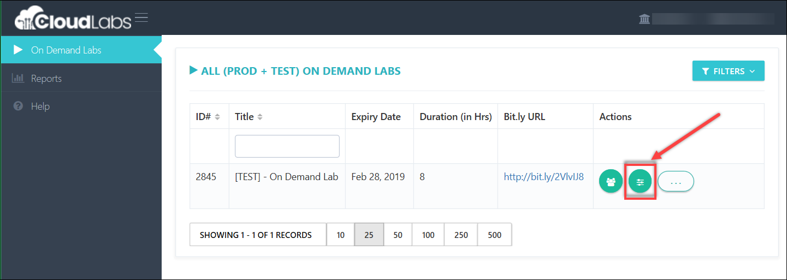
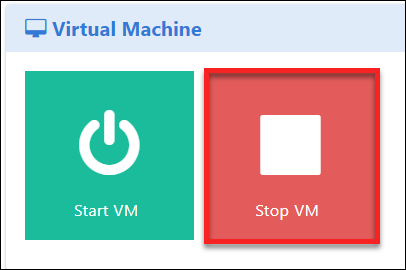
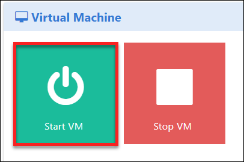
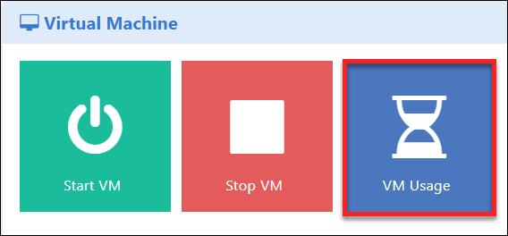
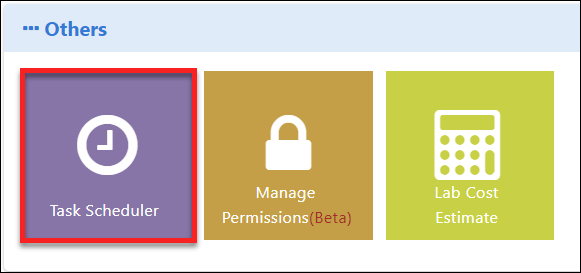
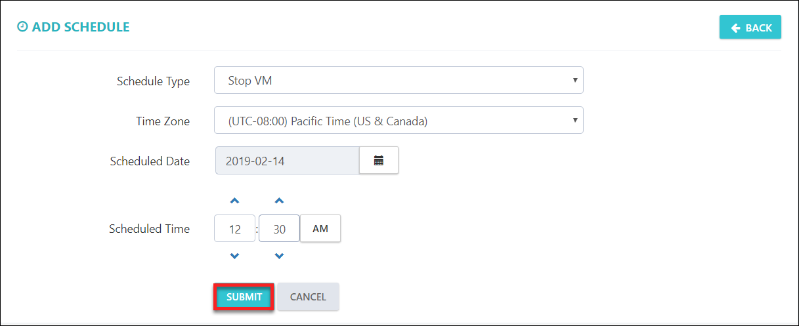

[Home](./../README.md)

# Control Panel:

**You can manages the recources like VMs, Databricks Clusters, SQL data warehouse, and so on.. from Control panel.**
1. Open the control panel as shown in below image. 
   
2. Stop the Virtual Machines.
   If you want to stop all the Virtual Machines for a particular ODL, you can stop all VMs together by clicking on **Stop VM**.  
   
3. Start the Virtual Machines.
If you want to stop all the Virtual Machines for a particular ODL, you can start all VMs together by clicking on **Start VM**.   
 
4. Virtual Machine Usage.
You can find the VM usage hours by clicking on VM usage option.  
  
5. You can also schedule the tasks like Stop/Start the Vms as per your requirement, click on task scheduler.

6. You'd need to add the schedule, following is showing adding schedule for Stop VM.
 
 
 
[Back](./View_Users_Page_readme.md#view-users-page) &nbsp;&nbsp;&nbsp;&nbsp;&nbsp;&nbsp;&nbsp;&nbsp;&nbsp;&nbsp;&nbsp;&nbsp;&nbsp;&nbsp;&nbsp;&nbsp;&nbsp;&nbsp;&nbsp;&nbsp;&nbsp;&nbsp;&nbsp;&nbsp;&nbsp;&nbsp;&nbsp;&nbsp;&nbsp;&nbsp;&nbsp;&nbsp;&nbsp;&nbsp;&nbsp;&nbsp;&nbsp;&nbsp;&nbsp;&nbsp;&nbsp;&nbsp;&nbsp;&nbsp;&nbsp;&nbsp;&nbsp;&nbsp;&nbsp;&nbsp;&nbsp;&nbsp;&nbsp;&nbsp;&nbsp;&nbsp;&nbsp;&nbsp;&nbsp;&nbsp;&nbsp;&nbsp;&nbsp;&nbsp;&nbsp;&nbsp;&nbsp;&nbsp;&nbsp;&nbsp;&nbsp;&nbsp;&nbsp;&nbsp;&nbsp;&nbsp;&nbsp;&nbsp;&nbsp;&nbsp;&nbsp;&nbsp;&nbsp;&nbsp;&nbsp;&nbsp;&nbsp;&nbsp;&nbsp;&nbsp;&nbsp;&nbsp;&nbsp;&nbsp;&nbsp;&nbsp;&nbsp;&nbsp;&nbsp;&nbsp;&nbsp;&nbsp;&nbsp;&nbsp;&nbsp;&nbsp;&nbsp;&nbsp;&nbsp;&nbsp;&nbsp;&nbsp;&nbsp;&nbsp;&nbsp;&nbsp;&nbsp;&nbsp;&nbsp;&nbsp;&nbsp;&nbsp;&nbsp;&nbsp;&nbsp;&nbsp;&nbsp;[Next](./Support_Information_readme.md#support-information) 

