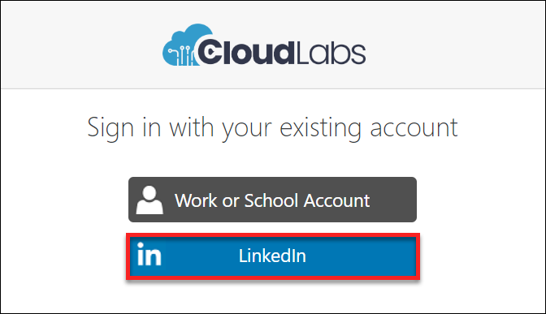

# Login to CloudLabs Portal

## Folow the below steps:

1. Navigate to **CloudLabs Admin Portal**: https://admin.cloudlabs.ai/

>**If you are not yet onboarded, reach out to cloudlabs@spektrasystems.com.**

2. Click on **Log In** button on right top of the page

  

3. You have following Login Options:
* **Azure Active Directory** (Work or School account)
* **LinkdeIn**

>**Select the account which is onboarded on CloudLabs.**

4. If your Work account is onboarded, select Work or School account:
   
  
* Enter your credentials and Sign In
   
   

5. If your LinkedIn account is onboarded, select LinkedIn account:
   
   
    
* Enter your LinkedIn credentials and Sign In
   
   
