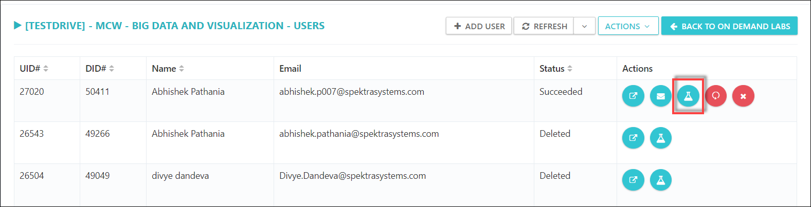

# View Users Page
## You should've open the ODLs(on demand labs) to get users details.
Click on **Users** option as shown below:

 

a. Getting user lab details, Click on **View lab status** option as shown in below image:

b. Sending email to users with lab details

c. Deleting/reset user's lab
