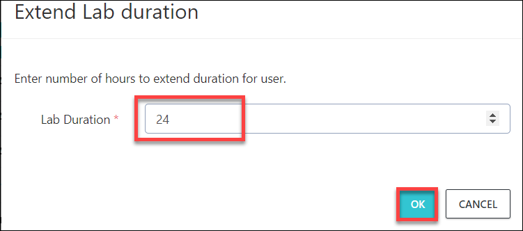

[Home](./../README.md)

# View Users Page
In the ON Demand Labs page open **Users** panel corresponding to the ODL as shown below:

 

a. You'll see the user list inside Users panel, click on lab status option to get more details:

 

b. To extend the user lab duration, follow the steps below:
* Click on extend duration option as shown below:

 
 
* Enter the value in hours to add on to the Hours remaining in the duration column and click on Ok
  

c. To send email to user with lab details, click on send invite button as shown below:

>User will recieve email with lab details like:
>Azure Username, Password
>Lab VM DNS name, VM username,  VM Password, etc

d. You can also open the lab details page and send the URL to user by following below steps:
* Open invite link in new tab:

 

* Copy the URL form this tab, share with the user:

 

e. Delete and Reset the user lab:

* If you want to delete the user's lab environment, click on delete option:

 
 
* If you want to reset the user's lab environment, click on reset option:

 
 
[Back](./View_ODL_and_Bit.ly_link_readme.md#view-odlon-demand-labs-and-bitly-link) &nbsp;&nbsp;&nbsp;&nbsp;&nbsp;&nbsp;&nbsp;&nbsp;&nbsp;&nbsp;&nbsp;&nbsp;&nbsp;&nbsp;&nbsp;&nbsp;&nbsp;&nbsp;&nbsp;&nbsp;&nbsp;&nbsp;&nbsp;&nbsp;&nbsp;&nbsp;&nbsp;&nbsp;&nbsp;&nbsp;&nbsp;&nbsp;&nbsp;&nbsp;&nbsp;&nbsp;&nbsp;&nbsp;&nbsp;&nbsp;&nbsp;&nbsp;&nbsp;&nbsp;&nbsp;&nbsp;&nbsp;&nbsp;&nbsp;&nbsp;&nbsp;&nbsp;&nbsp;&nbsp;&nbsp;&nbsp;&nbsp;&nbsp;&nbsp;&nbsp;&nbsp;&nbsp;&nbsp;&nbsp;&nbsp;&nbsp;&nbsp;&nbsp;&nbsp;&nbsp;&nbsp;&nbsp;&nbsp;&nbsp;&nbsp;&nbsp;&nbsp;&nbsp;&nbsp;&nbsp;&nbsp;&nbsp;&nbsp;&nbsp;&nbsp;&nbsp;&nbsp;&nbsp;&nbsp;&nbsp;&nbsp;&nbsp;&nbsp;&nbsp;&nbsp;&nbsp;&nbsp;&nbsp;&nbsp;&nbsp;&nbsp;&nbsp;&nbsp;&nbsp;&nbsp;&nbsp;&nbsp;&nbsp;&nbsp;&nbsp;&nbsp;&nbsp;&nbsp;&nbsp;&nbsp;&nbsp;&nbsp;&nbsp;&nbsp;&nbsp;&nbsp;&nbsp;&nbsp;&nbsp;&nbsp;&nbsp;&nbsp;[Next](./Control_Panel_readme.md)
